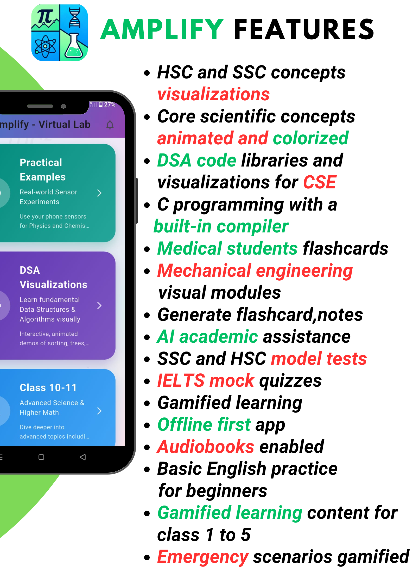

  
   
  <h1>🔬 Amplify</h1>
  
  
  
  
  
  

---

## 🎯 Overview

> Amplify is an all-in-one virtual learning lab designed to help students **visualize, not memorize**. The app offers interactive simulations for Physics, Chemistry, Biology, Math, and ICT—from school to college level. It also includes DSA visualizations, a built-in C compiler, mechanical engineering visuals, AI tools for learning assistance, and SMS-based services for rural students.

🌐 **Download the app**: [amplifypro.netlify.app](https://amplifypro.netlify.app)

📴 **Offline First**: Access core features without internet connectivity

---

## ✨ Features

### 📚 Virtual Labs
- **Physics Lab**: Interactive simulations for mechanics, optics, electricity, and more
- **Chemistry Lab**: Molecular modeling, reaction simulations, and periodic table explorer
- **Biology Lab**: 3D organ models, cell structure visualization, and ecosystem simulations
- **Math Lab**: Graph plotters, geometry tools, and equation solvers
- **ICT Lab**: Programming environment with syntax highlighting and code execution

### 🧮 DSA Visualizations
- Step-by-step algorithm animations
- Data structure demonstrations (arrays, linked lists, trees, graphs)
- Complexity analysis tools

### 💻 Programming & Code Learning
- **Built-in C Compiler**: Write, compile, and run C programs directly in the app
- **30+ ICT Basic Strengthening Codes**: Fundamental programming exercises and tutorials
- Syntax highlighting and error detection
- Sample programs and tutorials

### 🤖 AI-Powered Learning Tools
- **AI Assistant**: Powered by **Llama API** for context-aware explanations
- **AI-Powered Notes Generator**: Automatically create study notes from any topic
- **AI Flashcards Generator**: Generate custom flashcards for efficient memorization
- **AI Quiz Generator**: Create practice quizzes tailored to your learning needs
- Homework help and concept clarification
- Interactive Q&A sessions

### 🎓 Exam Preparation & Study Resources
- **HSC Exam Preparation**: Exam-focused content and quizzes (FREE)
- **HSC Quizzes**: Topic-wise practice questions with instant feedback (FREE)
- **MBBS Flashcards**: Medical terminology and concepts for aspiring doctors
- **IELTS Prep Exams**: Full-length practice tests for IELTS preparation
- **300+ Vocabulary Builder**: Essential words with definitions and usage examples
- **English Basic Foundations**: Grammar, comprehension, and writing skills
- Progress tracking and analytics

### 🎧 Audiobooks & Content
- Educational audiobooks for on-the-go learning
- Subject-wise audio content
- Text-to-speech functionality for any content

### 🏛️ Academic Updates & Resources
- **University Admission Updates**: Latest circulars and deadlines
- **Scholarship Opportunities**: Curated list of scholarships for Bangladeshi students
- Real-time notifications for important updates

### 🚨 Emergency Management Lessons (FREE)
- Disaster preparedness training
- First aid and safety protocols
- Crisis management strategies
- Community resilience education

### 🎮 Gamified Learning
- **Class 1-5 Gamified Learning**: Interactive games for young learners
- **Brain Exercises**: Mental math challenges, memory games, reaction time tests (FREE)
- Leaderboards and achievement badges
- Fun and engaging learning paths

### 🔧 Mechanical Engineering Practical Visuals
- 3D models of mechanical components
- Assembly and operation animations
- Engineering diagrams and schematics

### 🤖 Robotics Knowledge
- Introduction to robotics concepts
- Programming for robots
- Real-world robotics applications

### 📱 SMS Services for Rural Students
> Designed for students without reliable internet access

- **Exam Suggestions**: Board exam tips delivered via SMS
- **Daily Vocabulary**: One word per day to build language skills
- **Scientific Facts**: Interesting science facts daily
- **Study Tricks & Tips**: Learning strategies and shortcuts
- **Mnemonic Tricks**: Memory aids for complex topics
- Powered by **SMS API**, **Subscription API**, and **CaaS API**

### 💳 Subscription System
- OTP-based verification via **Applink SMS API**
- Secure payment integration
- Premium content access management
- Flexible subscription plans

---

## 🛠️ Tech Stack

### **Client Side**
- **Framework**: Flutter & Dart
- **State Management**: Provider
- **HTTP Client**: http package
- **Web Parsing**: html package
- **Local Storage**: shared_preferences
- **Offline-First Architecture**: Cached data for seamless offline access

### **Server Side**
- **Backend**: PHP (Custom API)
- **Hosting**: AWS EC2 (Ubuntu Linux)
- **Storage**: Local file-based storage (JSON/text)

### **Third-Party Services**
- **AI**: Llama API (Generative AI Assistant)
- **SMS/OTP**: Applink SMS API
- **Subscription**: Applink Subscription API
- **Billing & Messaging**: CaaS API (Carrier as a Service)

### **Architecture**
- RESTful API communication between Flutter client and PHP backend
- Cloud-hosted backend for scalability
- Modular feature design for easy maintenance
- Offline-first design with intelligent caching

---

## 📦 Key Packages

| Package | Purpose |
|---------|---------|
| `provider` | State management |
| `http` | REST API requests |
| `html` | Web content parsing |
| `shared_preferences` | Lightweight local data persistence |
| `firebase_core` | Firebase initialization |
| `firebase_analytics` | User analytics tracking |
| `model_viewer_plus` | 3D model rendering |
| `webview_flutter` | In-app web content display |
| `flutter_tts` | Text-to-speech functionality |
| `sensors_plus` | Device sensor integration |
| `fl_chart` | Data visualization and charts |

---

## 🆓 Free Features

The following features are completely **FREE** for all users:
- ✅ Emergency Management Lessons
- ✅ HSC Quizzes
- ✅ Gamified Brain Exercises (Mental Math, Memory, Reaction Time)
- ✅ Basic Virtual Lab Simulations
- ✅ Offline Access to Downloaded Content

---

## 🚀 Getting Started

### Prerequisites
- Flutter SDK (>=3.7.2 <4.0.0)
- Android Studio or VS Code with Flutter extensions
- An Android device or emulator (min SDK 21)

### Installation

1. **Clone the repository**
git clone https://github.com/Adnann07/Amplifyapp.git
cd Amplifyapp

2. **Install dependencies**
flutter pub get

3. **Run the app**
flutter run

4. **Build APK** (for distribution)
flutter build apk --release

---
## 📱 Usage

1. **Open the app**  
Install the APK from [amplifypro.netlify.app](https://amplifypro.netlify.app) or build it from source.

2. **Explore Virtual Labs**  
Navigate to Physics, Chemistry, Biology, Math, or ICT labs and select an experiment or simulation.

3. **Use AI Assistant**  
Tap the AI chat icon to ask questions, generate notes, create flashcards, or build custom quizzes.

4. **Write & Run Code**  
Go to the C Compiler section or ICT basics, write your program, and hit "Run" to see output instantly.

5. **Practice for Exams**  
Access HSC quizzes, IELTS prep tests, MBBS flashcards, and vocabulary builder for comprehensive exam preparation.

6. **Play Brain Games**  
Challenge yourself with mental math, memory exercises, and reaction time tests to sharpen your mind.

7. **Subscribe for Premium**  
Access premium features by subscribing through OTP verification via Banglalink.

8. **SMS Services** (for rural students)  
Subscribe to receive exam tips, daily vocabulary, and study tricks directly to your phone via SMS.

> 💡 **Tip**: Download content while online to access it anytime, even without internet!

---

## 🎨 Features summary 

  
  

---

## 🤝 Contributing

Contributions are welcome! If you'd like to contribute:

1. Fork the repository
2. Create a feature branch (`git checkout -b feature/AmazingFeature`)
3. Commit your changes (`git commit -m 'Add some AmazingFeature'`)
4. Push to the branch (`git push origin feature/AmazingFeature`)
5. Open a Pull Request

---

## 📄 License

This project is licensed under the MIT License – see the [LICENSE](LICENSE) file for details.

---

## 🙏 Acknowledgments

- **Flutter & Dart** teams for the cross-platform framework
- **AWS** for reliable cloud infrastructure
- **Llama AI** for intelligent learning assistance
- **Applink** for telecom integration and SMS services
- HSC teachers and students who inspired this virtual lab concept
- Rural educators working to bridge the digital divide

---

## 📧 Contact

For questions, feedback, or collaboration:

- **GitHub**: [@Adnann07](https://github.com/Adnann07)
- **Website**: [amplifypro.netlify.app](https://amplifypro.netlify.app)

---

Made with ❤️ for Bangladeshi students
 
<em>Empowering learners from cities to villages</em>

